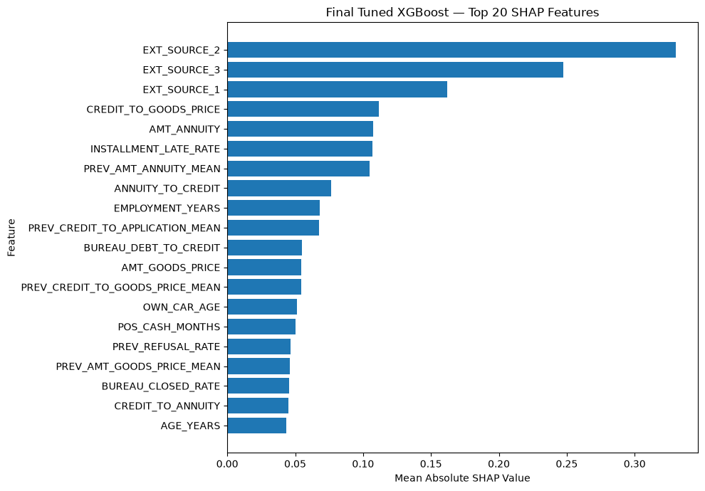

# Credit Risk Prediction & Model Validation

An end-to-end machine learning project for predicting loan default risk
and evaluating the reliability, performance, explainability, and stability
of credit risk models.

The project uses the Home Credit Default Risk dataset and follows a
model-risk-oriented workflow covering:

- Exploratory Data Analysis
- Data Quality and Risk Checks
- Feature Engineering
- Imbalanced Classification
- Baseline and Advanced Modeling
- Model Evaluation
- Probability Calibration
- Threshold Analysis
- Segment Stability
- SHAP Explainability
- Model Risk Validation

## Project Objective

Credit risk models estimate the likelihood that a borrower will default
on a loan.

The objective of this project was not only to build a predictive model,
but also to evaluate whether the model was reliable enough to support
risk-based decision making.

The workflow therefore focuses on both:

1. Predictive performance
2. Model validation and risk assessment

## Final Model Results

The final model is a regularized XGBoost classifier.

| Metric | Result |
|---|---:|
| Test ROC-AUC | 0.7829 |
| Test PR-AUC | 0.2769 |
| Classification Threshold | 0.2134 |
| Test Precision | 31.96% |
| Test Recall | 30.32% |
| Test F1-score | 31.12% |

The model was evaluated on a completely held-out test set that was not
used for model or threshold selection.

## Model Comparison

A logistic regression model was first developed as a baseline.
XGBoost was then introduced to capture nonlinear relationships and
interactions between credit-risk variables.

| Model | Test ROC-AUC | Test PR-AUC |
|---|---:|---:|
| Logistic Regression | 0.7619 | 0.2454 |
| Original XGBoost | 0.7809 | 0.2744 |
| Final Tuned XGBoost | **0.7829** | **0.2769** |

A controlled tuning round improved both ROC-AUC and PR-AUC while
avoiding extensive hyperparameter searching.

## Model Risk Validation

The final model was evaluated beyond ROC-AUC to assess its reliability
and behavior under different conditions.

### Discrimination

The final model achieved a test ROC-AUC of 0.7829 and PR-AUC of 0.2769.

ROC-AUC evaluates ranking ability, while PR-AUC is particularly useful
for this problem because the default class represents only approximately
8% of observations.

### Calibration

Predicted probabilities were compared with observed default rates
across probability deciles using a calibration curve.

The model showed generally reasonable alignment between predicted and
observed default rates.

### Threshold Analysis

The conventional 0.5 threshold produced high precision but very low
default recall.

A threshold of 0.2134 was selected on the validation set to target
approximately 30% recall.

When applied unchanged to the test set:

- Precision: 31.96%
- Recall: 30.32%
- F1-score: 31.12%

This demonstrates the importance of selecting an operating threshold
based on the intended risk objective rather than automatically using 0.5.

### Generalization

Validation and test performance were closely aligned:

- Validation ROC-AUC: 0.7805
- Test ROC-AUC: 0.7829
- Validation PR-AUC: 0.2742
- Test PR-AUC: 0.2769

This provides evidence of reasonably stable out-of-sample performance.

### Segment Stability

Model discrimination was evaluated across age and income segments.
No major collapse in ROC-AUC was observed across the evaluated segments.

The lowest observed age-segment ROC-AUC was approximately 0.735,
while income-segment ROC-AUC remained above approximately 0.766.

## Explainability

SHAP was used to understand the features contributing most strongly
to the final model's predictions.

The strongest contributors included:

1. EXT_SOURCE_2
2. EXT_SOURCE_3
3. EXT_SOURCE_1
4. CREDIT_TO_GOODS_PRICE
5. AMT_ANNUITY
6. INSTALLMENT_LATE_RATE
7. PREV_AMT_ANNUITY_MEAN
8. ANNUITY_TO_CREDIT
9. EMPLOYMENT_YEARS
10. PREV_CREDIT_TO_APPLICATION_MEAN

The external credit-related variables were the dominant contributors,
followed by loan affordability/structure and historical repayment
behavior.

SHAP importance measures contribution magnitude and does not by itself
establish causality or the direction of a feature's effect.

## Model Risk Limitations

The project demonstrates a model-risk-oriented validation workflow,
but the model should not be considered production-ready.

Important remaining validation areas include:

- Out-of-time / temporal validation
- Population Stability Index (PSI)
- Feature and population drift monitoring
- Formal fairness and disparate-impact analysis
- Cost-sensitive threshold optimization
- Probability recalibration if required
- Challenger model comparison
- Production monitoring and model governance controls

The dataset is also a historical benchmark dataset rather than a
production credit portfolio, so real-world deployment would require
additional validation and governance.
