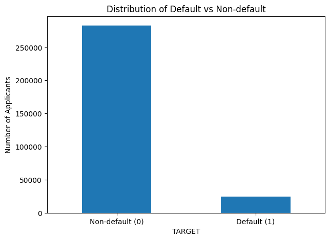
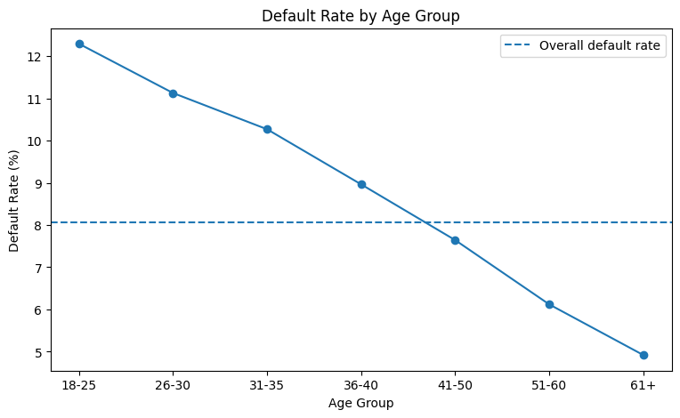
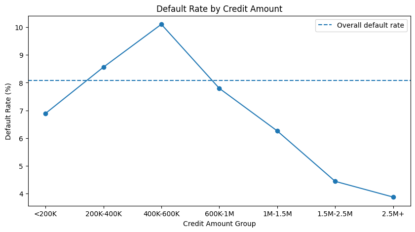
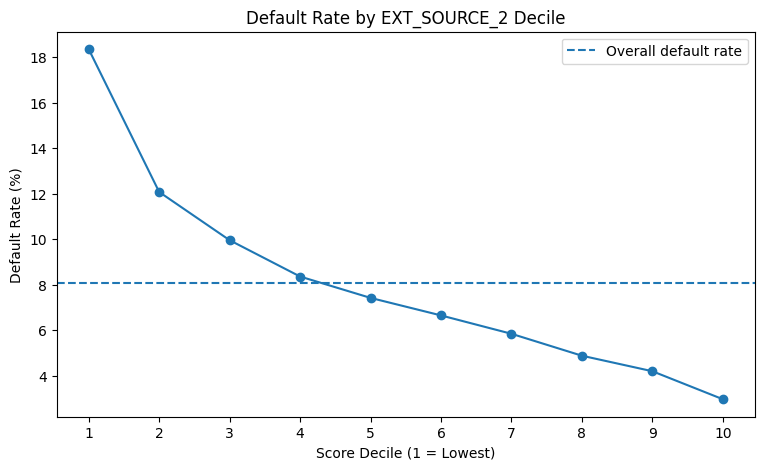
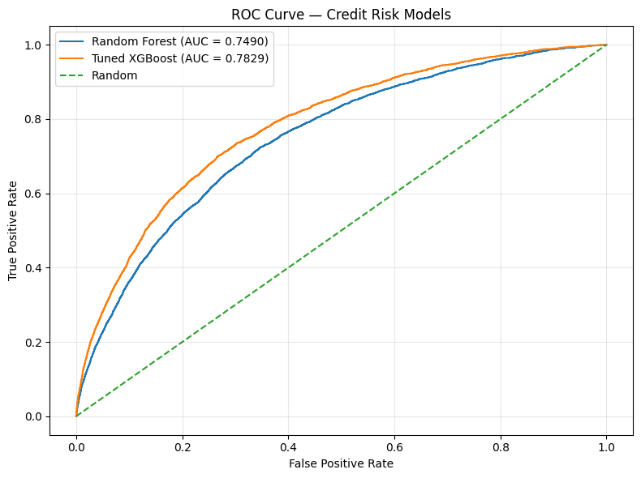
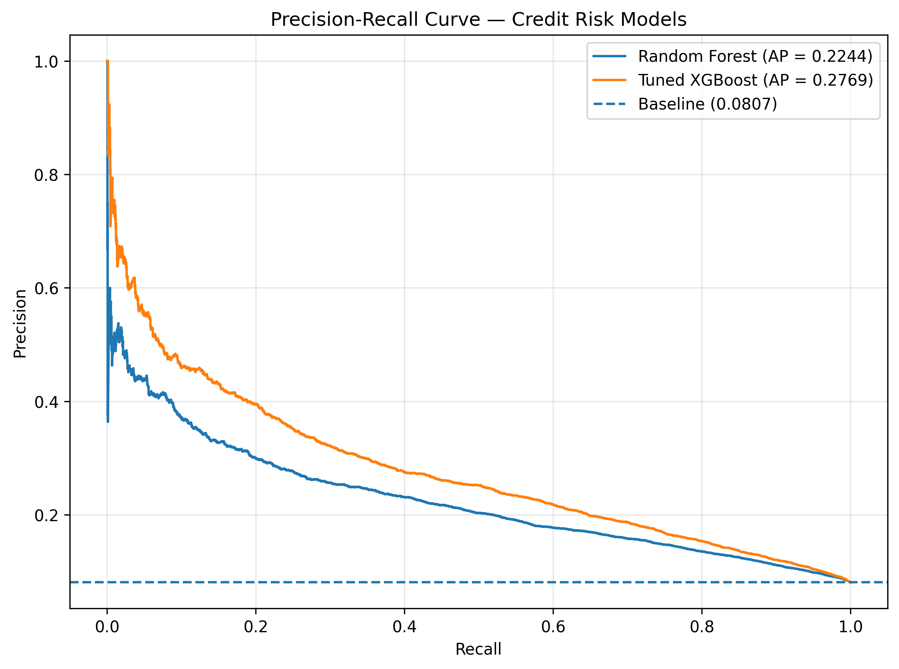
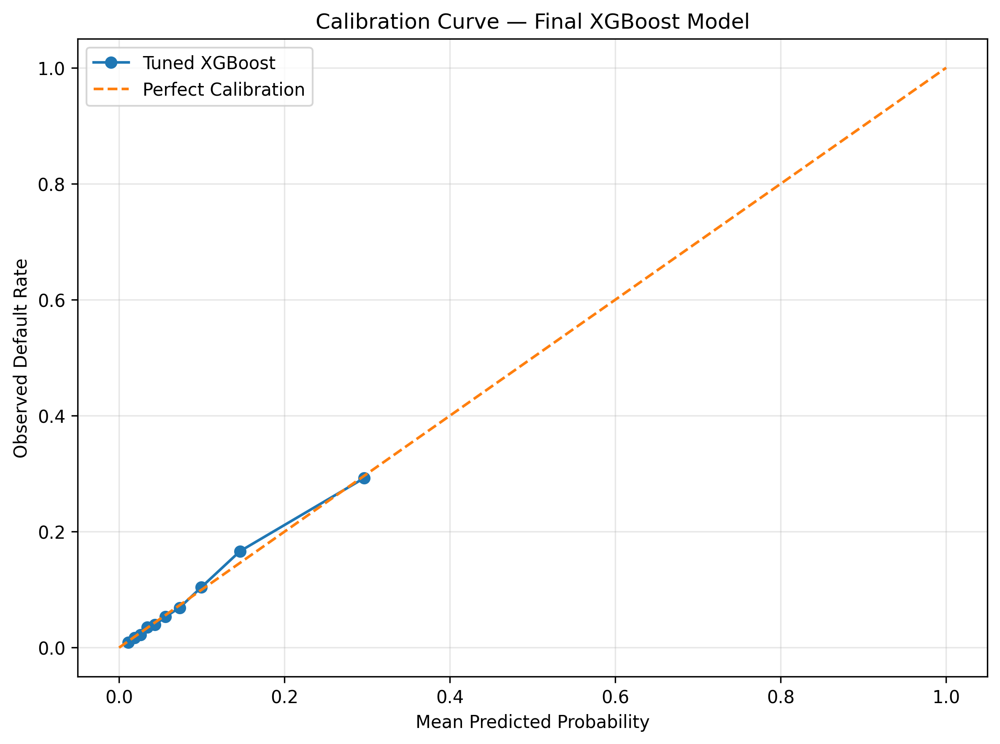
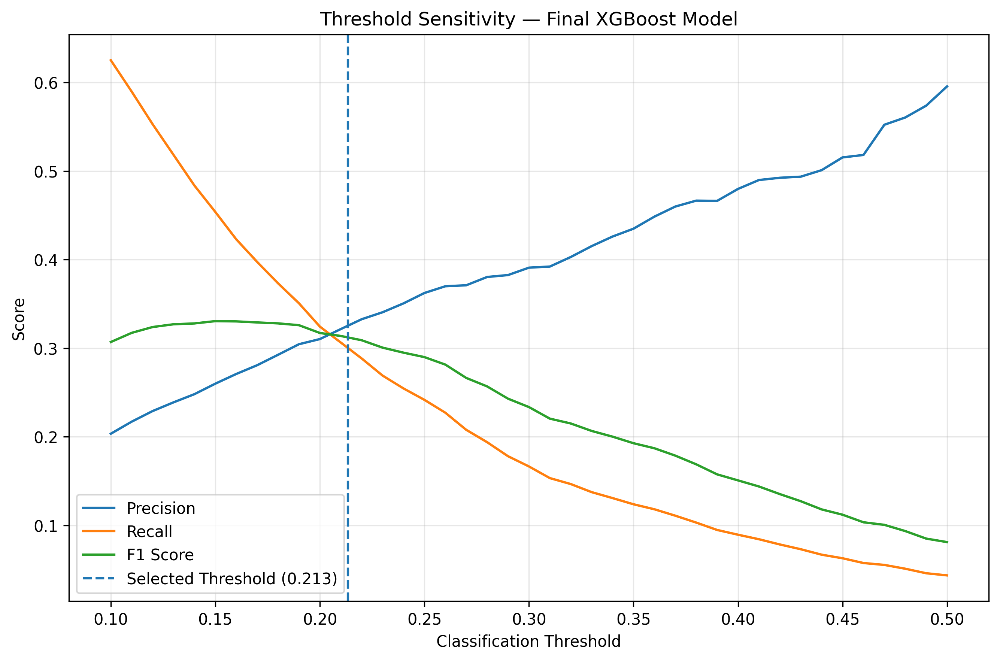
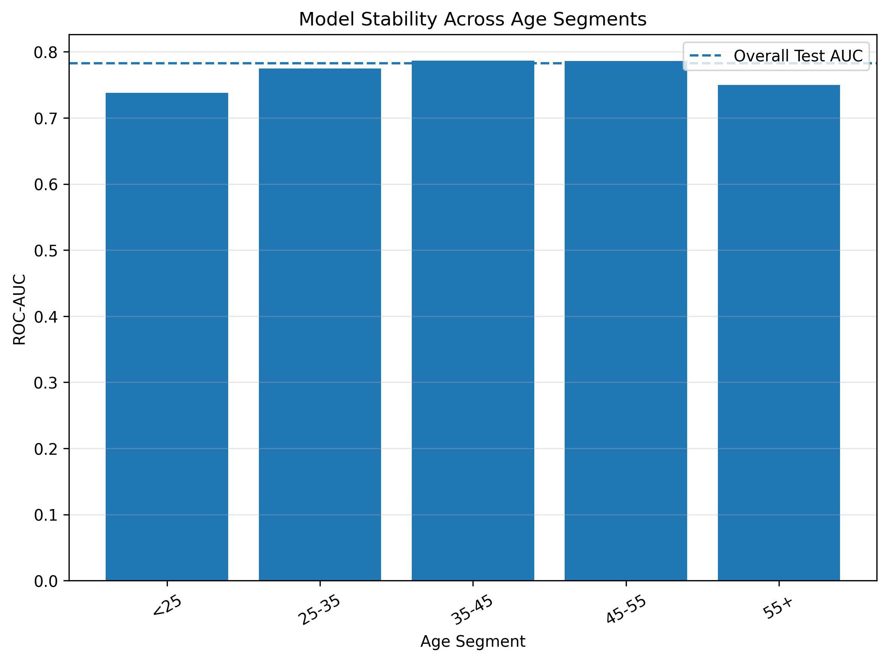
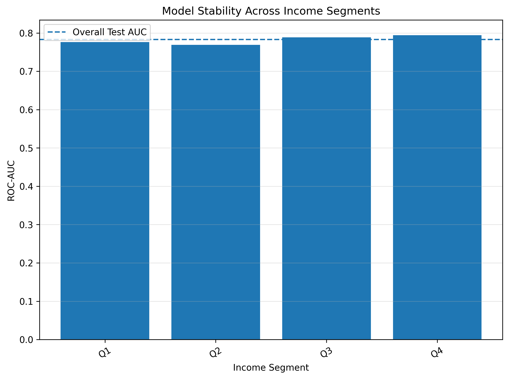

# Credit Risk Prediction & Model Validation

An end-to-end machine learning project for predicting loan default risk
and evaluating the reliability, performance, explainability, and stability
of credit risk models.

The project uses the **Home Credit Default Risk** dataset and follows a
model-risk-oriented workflow covering:

- Exploratory Data Analysis
- Data Quality and Risk Checks
- Feature Engineering
- Imbalanced Classification
- Baseline and Advanced Modeling
- Model Evaluation
- Probability Calibration
- Threshold Analysis
- Segment Stability
- SHAP Explainability
- Model Risk Validation

---

## Project Objective

Credit risk models estimate the likelihood that a borrower will default
on a loan.

The objective of this project was not only to build a predictive model,
but also to evaluate whether the model was reliable enough to support
risk-based decision making.

The workflow therefore focuses on both:

1. Predictive performance
2. Model validation and risk assessment

---

# Dataset

The project uses the **Home Credit Default Risk** dataset.

The main application dataset contains:

- **307,511 applicants**
- **8.07% observed default rate**
- 122 original application variables

Historical credit behavior was incorporated from:

- Previous applications
- Bureau credit history
- Bureau balance history
- Installment payments
- POS/CASH balance
- Credit card balance

Historical tables were aggregated at the applicant level and combined
with application-level variables.

---

# Exploratory Data Analysis

## Target Distribution

The dataset is highly imbalanced:

| Class | Applicants | Percentage |
|---|---:|---:|
| Non-default (0) | 282,686 | 91.93% |
| Default (1) | 24,825 | 8.07% |

This imbalance makes accuracy alone an unsuitable primary evaluation
metric. ROC-AUC, PR-AUC, precision, recall, and F1-score were therefore
used during model evaluation.



---

## Default Rate by Age

Default rates showed a clear relationship with applicant age.

Younger applicants had substantially higher observed default rates,
while default rates generally decreased across older age groups.

| Age Group | Default Rate |
|---|---:|
| 18–25 | 12.29% |
| 26–30 | ~11.1% |
| 31–35 | ~10.3% |
| 36–40 | ~9.0% |
| 41–50 | ~7.6% |
| 51–60 | ~6.1% |
| 61+ | 4.92% |



---

## Default Rate by Credit Amount

Credit amount showed a nonlinear relationship with observed default
rates.

The highest observed default rate occurred in the mid-range
credit-amount group, after which the default rate generally decreased.



This demonstrates why nonlinear models such as XGBoost can capture
relationships that may not be represented well by a simple linear
model.

---

## Default Rate by EXT_SOURCE_2

EXT_SOURCE variables showed some of the strongest relationships with
default risk.

Applicants in the lowest EXT_SOURCE_2 decile had substantially higher
default rates than applicants in the highest deciles.



This relationship was later supported by the SHAP analysis, where
`EXT_SOURCE_2` was the strongest contributor to the final model.

---

# Data Quality & Risk Checks

Several data-quality and consistency checks were performed before
modeling.

### Key findings

- Exact duplicate rows: **0**
- Duplicate applicant IDs: **0**
- Missing applicant IDs: **0**
- `DAYS_EMPLOYED = 365243`: **55,374 applicants**
- `ORGANIZATION_TYPE = XNA`: **55,374 applicants**
- The two special-value patterns showed exact correspondence.
- No obvious direct target leakage was identified in the application
  table.
- Historical temporal leakage was identified as an important production
  validation consideration.

Outliers and unusual values were investigated rather than automatically
removed.

---

# Feature Engineering

Applicant-level and historical behavioral features were created.

Examples include:

### Application-level features

- `AGE_YEARS`
- `EMPLOYMENT_YEARS`
- `INCOME_PER_FAMILY_MEMBER`
- `CREDIT_TO_INCOME`
- `ANNUITY_TO_INCOME`
- `CREDIT_TO_ANNUITY`
- `CREDIT_TO_GOODS_PRICE`
- `ANNUITY_TO_CREDIT`

### Previous application features

- `PREV_APP_COUNT`
- `PREV_APPROVED_COUNT`
- `PREV_REFUSED_COUNT`
- `PREV_APPROVAL_RATE`
- `PREV_REFUSAL_RATE`
- `PREV_AMT_CREDIT_MEAN`
- `PREV_AMT_ANNUITY_MEAN`
- `PREV_CREDIT_TO_APPLICATION_MEAN`

### Bureau features

- `BUREAU_CREDIT_COUNT`
- `BUREAU_ACTIVE_COUNT`
- `BUREAU_CLOSED_COUNT`
- `BUREAU_DEBT_TO_CREDIT`
- `BUREAU_OVERDUE_RATE`
- `BUREAU_CREDIT_SUM_TOTAL`
- `BUREAU_DEBT_SUM_TOTAL`

### Installment features

- `INSTALLMENT_PAYMENT_DELAY_MEAN`
- `INSTALLMENT_LATE_RATE`
- `INSTALLMENT_SEVERE_LATE_RATE`
- `INSTALLMENT_PAYMENT_RATIO_MEDIAN`
- `INSTALLMENT_FULL_PAYMENT_RATE`

### POS/CASH features

- `POS_CASH_MONTHS`
- `POS_CASH_DPD_RATE`
- `POS_CASH_DPD_OVER_30_RATE`
- `POS_CASH_DPD_OVER_90_RATE`
- `POS_CASH_MAX_DPD`

### Credit card features

- `CREDIT_CARD_UTILIZATION_MEAN`
- `CREDIT_CARD_UTILIZATION_MAX`
- `CREDIT_CARD_HIGH_UTILIZATION_RATE`
- `CREDIT_CARD_DPD_RATE`
- `CREDIT_CARD_DPD_OVER_30_RATE`
- `CREDIT_CARD_DPD_OVER_90_RATE`

The final modeling dataset contained:

- **307,511 applicants**
- **214 modeling features**
- **230 predictors before the final preprocessing/modeling selection**

---

# Train / Validation / Test Split

A stratified split was used to preserve the default rate across datasets.

| Dataset | Applicants | Default Rate |
|---|---:|---:|
| Train | 215,257 | 8.07% |
| Validation | 46,127 | 8.07% |
| Test | 46,127 | 8.07% |

The validation set was used for model/threshold decisions, while the
test set was held out for final evaluation.

---

# Model Development

## Logistic Regression Baseline

A class-weighted Logistic Regression model was used as the baseline.

### Validation Results

| Metric | Result |
|---|---:|
| ROC-AUC | **0.7619** |
| PR-AUC | **0.2454** |

The baseline established a reference point for evaluating the more
complex tree-based models.

---

## Random Forest Challenger

A Random Forest model was evaluated as a tree-based challenger.

### Results

| Metric | Validation | Test |
|---|---:|---:|
| ROC-AUC | 0.7512 | **0.7490** |
| PR-AUC | 0.2327 | **0.2244** |

The Random Forest performed below both Logistic Regression and XGBoost
on this dataset.



---

# XGBoost Modeling

XGBoost was introduced to capture nonlinear relationships and
interactions between credit-risk variables.

## Original XGBoost

| Metric | Validation | Test |
|---|---:|---:|
| ROC-AUC | 0.7793 | 0.7809 |
| PR-AUC | 0.2723 | 0.2744 |

---

## Final Tuned XGBoost

A controlled tuning round was performed using stronger regularization
and a smaller tree depth.

The final model used:

- `n_estimators = 1000`
- `max_depth = 4`
- `learning_rate = 0.03`
- `min_child_weight = 5`
- `subsample = 0.8`
- `colsample_bytree = 0.8`
- `reg_lambda = 5`
- `reg_alpha = 0.1`

### Final Model Comparison

| Model | Validation ROC-AUC | Validation PR-AUC | Test ROC-AUC | Test PR-AUC |
|---|---:|---:|---:|---:|
| Logistic Regression | 0.7619 | 0.2454 | — | — |
| Random Forest | 0.7512 | 0.2327 | 0.7490 | 0.2244 |
| Original XGBoost | 0.7793 | 0.2723 | 0.7809 | 0.2744 |
| **Final Tuned XGBoost** | **0.7805** | **0.2742** | **0.7829** | **0.2769** |

The final tuned XGBoost model achieved the strongest out-of-sample
performance among the evaluated models.

---

# Model Performance

## Final Test Results

| Metric | Result |
|---|---:|
| **ROC-AUC** | **0.7829** |
| **PR-AUC** | **0.2769** |
| **Brier Score** | **0.0662** |
| **Classification Threshold** | **0.2134** |
| **Precision** | **31.96%** |
| **Recall** | **30.32%** |
| **F1-score** | **31.12%** |

The test set was completely held out from model and threshold selection.

---

# ROC Curve

ROC-AUC measures how well the model ranks defaulted applicants above
non-defaulted applicants across different classification thresholds.

The final tuned XGBoost model achieved a test ROC-AUC of **0.7829**,
compared with **0.7490** for Random Forest.


---

# Precision-Recall Curve

Because only approximately 8% of applicants defaulted, PR-AUC provides
an important view of model performance on the minority class.

The final tuned XGBoost achieved:

**Test PR-AUC = 0.2769**



---

# Model Risk Validation

The final model was evaluated beyond predictive discrimination to
assess reliability and behavior under different conditions.

---

## 1. Discrimination

Final test performance:

- ROC-AUC: **0.7829**
- PR-AUC: **0.2769**

ROC-AUC evaluates ranking ability, while PR-AUC is particularly useful
for this imbalanced classification problem.

---

## 2. Calibration

Predicted probabilities were compared with observed default rates
across probability deciles.

### Brier Score

**0.0662**

The final model showed generally reasonable alignment between predicted
and observed default rates, although some deviations were present in
individual probability bands.



---

## 3. Threshold Analysis

Using the conventional 0.5 threshold resulted in very low recall for
the default class.

A threshold of **0.2134** was selected using the validation set to
target approximately **30% recall**.

The threshold was then applied unchanged to the test set.

### Validation

| Metric | Result |
|---|---:|
| Precision | 32.58% |
| Recall | 29.99% |
| F1-score | 31.24% |

### Test

| Metric | Result |
|---|---:|
| Precision | **31.96%** |
| Recall | **30.32%** |
| F1-score | **31.12%** |

This demonstrates why a classification threshold should be selected
according to the intended risk objective rather than automatically
using 0.5.



---

# Generalization

The final model achieved the following results:

| Dataset | ROC-AUC | PR-AUC |
|---|---:|---:|
| Train | 0.8221 | 0.3517 |
| Validation | 0.7805 | 0.2742 |
| Test | **0.7829** | **0.2769** |

The higher training performance indicates that some overfitting remains.

However, validation and test performance are closely aligned, providing
evidence of reasonably stable generalization to the held-out test set.

---

# Segment Stability

Model discrimination was evaluated across age and income segments.

This was performed as a **model stability analysis**, not as a formal
fairness or disparate-impact assessment.

## Age Stability

| Metric | ROC-AUC |
|---|---:|
| Minimum | **0.7379** |
| Maximum | **0.7868** |



No major performance collapse was observed across the evaluated age
segments.

---

## Income Stability

| Metric | ROC-AUC |
|---|---:|
| Minimum | **0.7689** |
| Maximum | **0.7944** |



Performance remained relatively consistent across the evaluated income
segments.

Formal fairness and disparate-impact analysis would require additional
investigation.

---

# Explainability

SHAP was used to understand which variables contributed most strongly
to the final XGBoost model's predictions.

## Top 20 SHAP Features

The strongest contributors included:

1. `EXT_SOURCE_2`
2. `EXT_SOURCE_3`
3. `EXT_SOURCE_1`
4. `CREDIT_TO_GOODS_PRICE`
5. `AMT_ANNUITY`
6. `INSTALLMENT_LATE_RATE`
7. `PREV_AMT_ANNUITY_MEAN`
8. `ANNUITY_TO_CREDIT`
9. `EMPLOYMENT_YEARS`
10. `PREV_CREDIT_TO_APPLICATION_MEAN`

Other important variables included:

- `BUREAU_DEBT_TO_CREDIT`
- `AMT_GOODS_PRICE`
- `PREV_CREDIT_TO_GOODS_PRICE_MEAN`
- `OWN_CAR_AGE`
- `POS_CASH_MONTHS`
- `PREV_REFUSAL_RATE`
- `PREV_AMT_GOODS_PRICE_MEAN`
- `BUREAU_CLOSED_RATE`
- `CREDIT_TO_ANNUITY`
- `AGE_YEARS`

The external credit-related variables were the dominant contributors,
followed by loan affordability/structure and historical repayment
behavior.


SHAP importance measures contribution magnitude and does not by itself
establish causality or the direction of a feature's effect.

---

# Key Model Risk Findings

The final validation process identified several important findings:

### Strong discrimination

The final model achieved a test ROC-AUC of **0.7829**.

### Imbalanced classification

The default rate was only **8.07%**, making PR-AUC and minority-class
metrics important.

### Threshold sensitivity

The default 0.5 threshold produced very low recall. A validation-based
threshold of **0.2134** improved identification of high-risk applicants
while maintaining a measurable precision level.

### Calibration

The final Brier Score was **0.0662**, with generally reasonable
alignment between predicted and observed probabilities.

### Generalization

Validation and test results were closely aligned:

- Validation ROC-AUC: **0.7805**
- Test ROC-AUC: **0.7829**

### Segment stability

Performance remained reasonably consistent across the evaluated age and
income segments.

### Explainability

SHAP analysis showed that external risk scores, loan structure,
affordability, employment, and repayment behavior were among the
strongest model drivers.

---

# Model Risk Limitations

The project demonstrates a model-risk-oriented validation workflow,
but the model should **not be considered production-ready**.

Important remaining validation areas include:

- Out-of-time / temporal validation
- Population Stability Index (PSI)
- Feature and population drift monitoring
- Formal fairness and disparate-impact analysis
- Cost-sensitive threshold optimization
- Probability recalibration if required
- Further challenger model comparison
- Production monitoring
- Model governance controls

Historical credit information also requires careful temporal treatment
in a production setting to ensure that only information available at the
time of the credit decision is used.

The dataset is a historical benchmark dataset rather than a production
credit portfolio, so real-world deployment would require additional
validation and governance.

---

# Project Structure

```text
credit-risk-prediction/
│
├── data/
│   ├── raw/
│   └── processed/
│
├── models/
│   ├── baseline_logistic_regression.pkl
│   ├── baseline_imputer.pkl
│   ├── baseline_scaler.pkl
│   ├── random_forest_challenger.pkl
│   ├── xgboost_baseline.pkl
│   └── final_tuned_xgboost.pkl
│
├── figures/
│   ├── default_distribution.png
│   ├── default_rate_by_age.png
│   ├── default_rate_by_credit_amount.png
│   ├── default_rate_by_ext_source_2.png
│   ├── roc_curve_model_comparison.png
│   ├── precision_recall_curve_model_comparison.png
│   ├── final_calibration_curve.png
│   ├── threshold_sensitivity.png
│   ├── stability_age_segments.png
│   ├── stability_income_segments.png
│   └── final_shap_feature_importance.png
│
└── README.md
